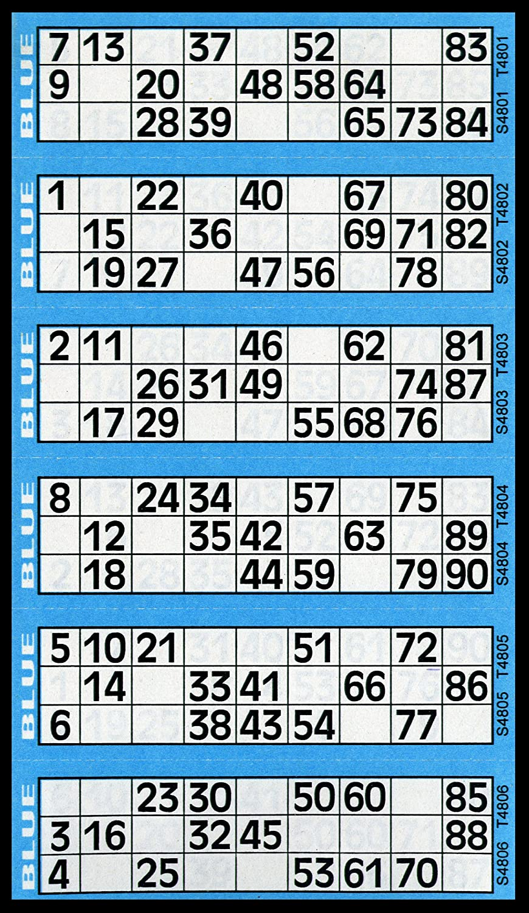
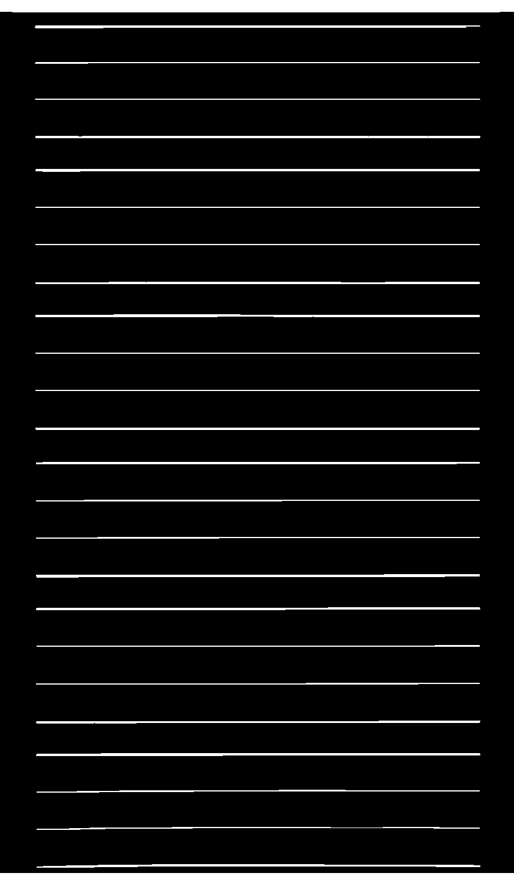
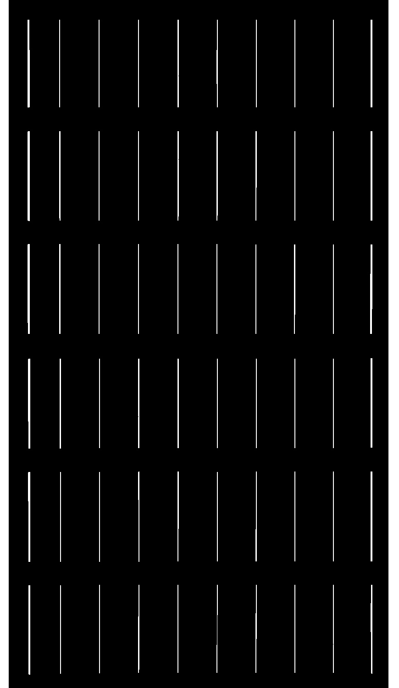

#<h1 align="center" style="text-align: center;"> Bingo Genie Replica </h1>

## Project Overview:
The purpose of this project was to gain experiance with the [Googles Tesseract OCR](https://opensource.google/projects/tesseract) and [OpenCV](https://opencv.org/).

I set out with the goal to be able to give the OpenCV2 Algorithm an image of a standard bingo book and be able to read the book and be able to play a whole game of bingo.

## How it works

<h4> Specify Book </h4>
  

  You specify the bingo book that you wish to read.  
  I used this example to read from, this is just a standard bingo book.
  
  
  

  <h4> identify horizontal and vertical lines to find boxes </h4>
  
  

  
  
  

