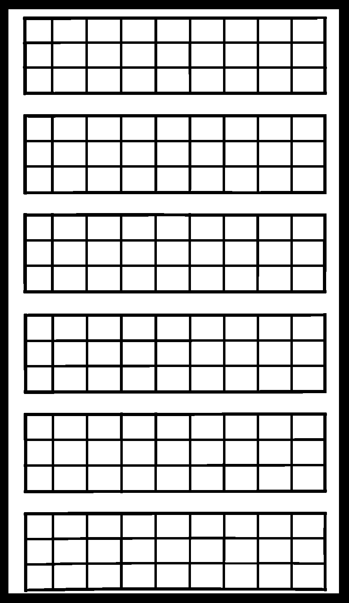
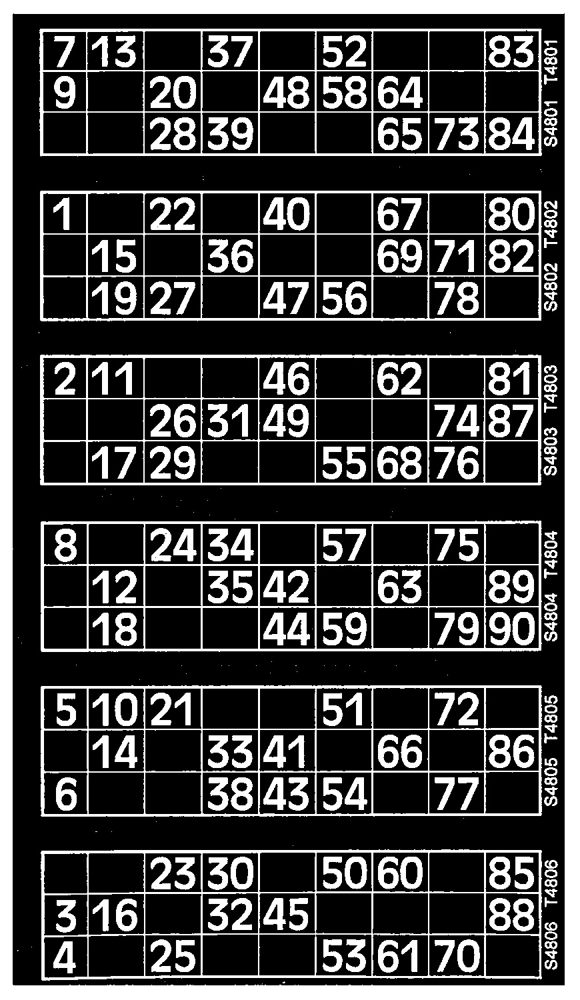

<h1 align="center" style="text-align: center;"> Bingo Genie Replica </h1>

## Project Overview:
The purpose of this project was to gain experiance with the [Googles Tesseract OCR](https://opensource.google/projects/tesseract) and [OpenCV](https://opencv.org/).

I set out with the goal to be able to give the OpenCV2 Algorithm an image of a standard bingo book and be able to read the book and be able to play a whole game of bingo.

## How it works

  <h3> Specify Book </h3>
  

  You specify the bingo book that you wish to read.  
  I used this example to read from, this is just a standard bingo book.  
    
  
  

 
  <h3> Identify horizontal and vertical lines to find boxes </h3>
  

  I then used OpenCV2 to find horizontal lines and vertical lines.  

  
  
  

<h3>Combine images</h3>
  

  I combine the vertical and horizontal images together to find all boxes on the sheet. 
  I then overlay this image with the original to get all of the numbers with thier boxes.  

  
  
  

<h3>I then extract each of these boxes</h3>
  

  I used <a href="https://opensource.google/projects/tesseract">Googles Tesseract OCR</a> to store all numbers in the boxes in an object  
  I store these numbers in a House object, then each these House objects is stores in a Page object, then these Page objects are stored ultimatly in a Game object.
  This gives the structure that a Game can contain multiple Pages and a Page can contain multiple Houses.  
  This adds the functionality to play multiple Pages for one game.  
  

